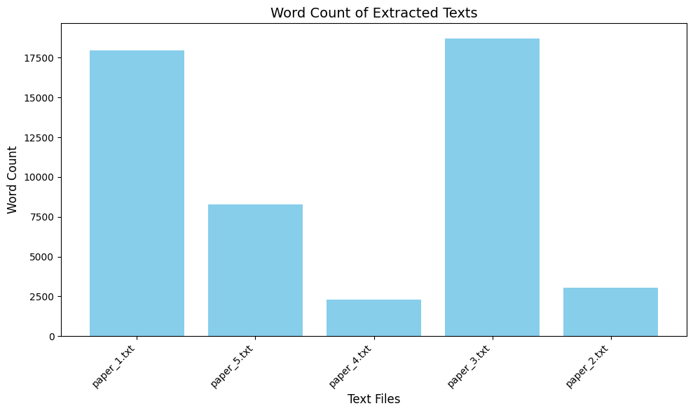
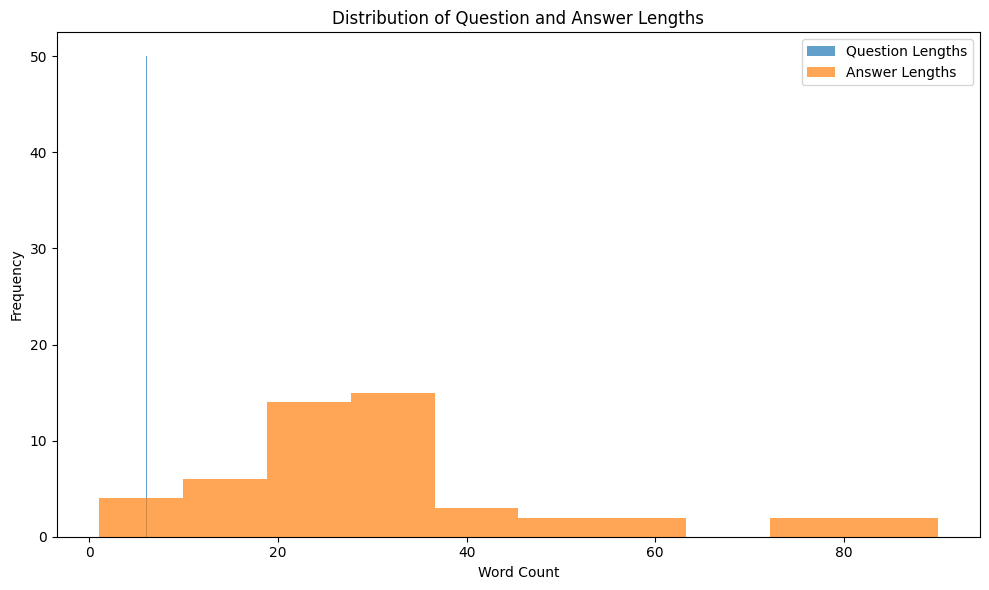

# 🔋 Battery AI Chat Assistant

[](https://www.python.org/)
[](https://huggingface.co/)
[](https://langchain.com/)
[](LICENSE)
[](CONTRIBUTING.md)

A conversational AI assistant designed to answer technical queries about battery performance, maintenance, and troubleshooting. This project leverages state-of-the-art Large Language Models (LLMs) fine-tuned on domain-specific datasets to provide insights into battery concepts such as **State of Charge (SOC)**, **State of Health (SOH)**, and **aging trends**.

---

## 🚀 Features

- **Domain Expertise**: Provides detailed responses to battery-related queries.
- **PDF Crawling and QA Generation**: Automated extraction of battery-related content from research papers to create question-answer datasets.
- **Interactive Interface**: User-friendly chatbot to simulate real-time Q&A.
- **Scalable**: Fine-tune with additional data to adapt to new scenarios.
- **Efficient Deployment**: Designed for seamless integration as a web app or API.

---

## 📂 Project Structure

```plaintext
.
├── data/                   # Battery-related datasets
├── pdfs/                   # Crawled and downloaded PDFs
├── extracted_text/         # Text extracted from PDFs
├── results/                # Processed results (e.g., QA pairs, visualizations)
│   ├── qa_pairs.json
│   ├── word_count_distribution.png
│   ├── qa_pair_statistics.png
├── models/                 # Pre-trained and fine-tuned LLMs
├── scripts/                # Scripts for preprocessing, training, and evaluation
├── app/                    # Chatbot application code (e.g., Flask/Streamlit)
├── README.md               # Project documentation
```

---

## 📜 How It Works

1. **PDF Crawling and Text Extraction**: Automatically crawls PDFs from sources like ArXiv, downloads them, and extracts meaningful text for processing.
2. **QA Pair Generation**: Converts extracted text into question-answer pairs for fine-tuning.
3. **Model Training**: Fine-tunes an open-source LLM (e.g., GPT-J, Llama) using the generated QA pairs.
4. **Chatbot Development**: Integrates the trained model into a chatbot interface.
5. **Deployment**: Deploys the chatbot as a web app or API for public use.

---

## 🛠️ Tools and Technologies

- **Programming Language**: Python
- **Machine Learning Frameworks**: Hugging Face Transformers, LangChain
- **Web Development**: Flask/Streamlit
- **Cloud Services**: AWS, Google Cloud (optional for deployment)

---

## 🌟 Goals

- Build an LLM-powered chatbot for answering battery-related queries.
- Ensure accurate and contextual responses using domain-specific datasets.
- Provide real-time assistance for battery maintenance and performance optimization.

---

## 🚧 Roadmap

- [x] Set up project structure and tools.
- [x] Collect and preprocess battery-related datasets.
- [x] Fine-tune a pre-trained LLM.
- [ ] Develop chatbot interface.
- [ ] Deploy chatbot as a web app/API.
- [ ] Document results and findings.

---

## 📊 Results

### 1. Word Count of Extracted Texts
We processed the extracted text from crawled PDFs and analyzed the word count distribution. Below is the visualization of word counts across the processed files:



**Description**:
- This bar chart represents the total number of words extracted from each text file.
- Highlights variability in the content length across PDFs.

---

### 2. QA Pair Statistics
We generated QA pairs from the extracted text and analyzed the distribution of question and answer lengths.



**Description**:
- This histogram shows the distribution of word counts in generated questions and answers.
- Useful for understanding the complexity and verbosity of the generated QA pairs.

---

### 3. Sample QA Pairs

#### QA Pair 1
- **Question**: What is discussed in section 1?
- **Answer**: The paper focuses on linking battery data to accelerate knowledge flow in battery science.

#### QA Pair 2
- **Question**: Why are batteries important?
- **Answer**: Batteries are pivotal for transitioning to a climate-friendly future.

#### QA Pair 3
- **Question**: What is the main contribution of this paper?
- **Answer**: The paper introduces a novel method for analyzing battery data using machine learning.

---

## 🤝 Contributing

Contributions are welcome! Please check out the [CONTRIBUTING.md](CONTRIBUTING.md) for guidelines.

---

## 📄 License

This project is licensed under the MIT License - see the [LICENSE](LICENSE) file for details.

---

## 📧 Contact

If you have any questions or suggestions, feel free to reach out:

- **Name**: Usama Yasir Khan
- **Email**: yasirusama61@gmail.com
- **GitHub**: [My GitHub Profile](https://github.com/yasirusama61)

---

**Let's make battery AI smarter together! 💡**
