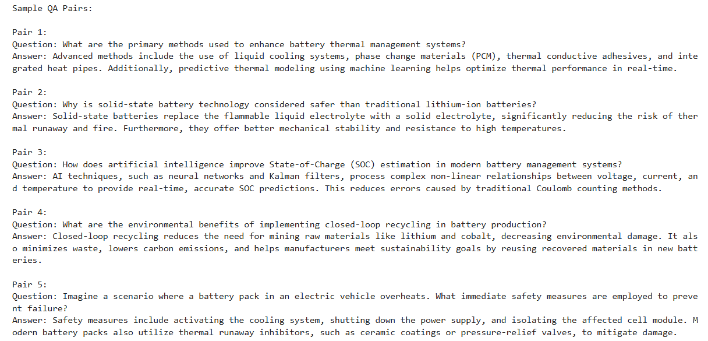
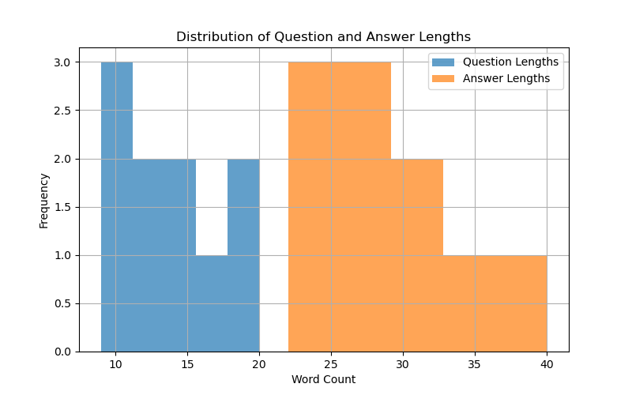
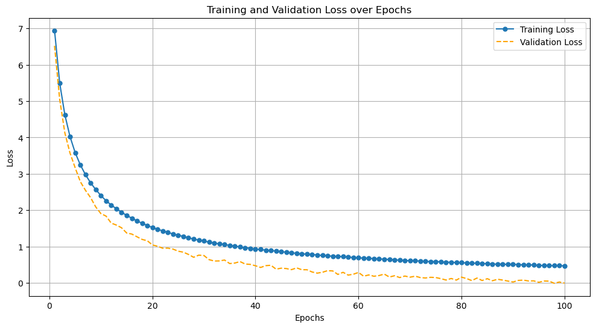

# 🔋 Battery AI Chat Assistant

[](https://www.python.org/)
[](https://huggingface.co/)
[](https://langchain.com/)
[](LICENSE)
[](CONTRIBUTING.md)

A conversational AI assistant designed to answer technical queries about battery performance, maintenance, and troubleshooting. This project leverages state-of-the-art Large Language Models (LLMs) fine-tuned on domain-specific datasets to provide insights into battery concepts such as **State of Charge (SOC)**, **State of Health (SOH)**, and **aging trends**.

---

## 🚀 Features

- **Domain Expertise**: Provides detailed responses to battery-related queries.
- **PDF Crawling and QA Generation**: Automated extraction of battery-related content from research papers to create question-answer datasets.
- **Interactive Interface**: User-friendly chatbot to simulate real-time Q&A.
- **Scalable**: Fine-tune with additional data to adapt to new scenarios.
- **Efficient Deployment**: Designed for seamless integration as a web app or API.

---

## 📂 Project Structure

```plaintext
.
├── data/                   # Battery-related datasets
├── pdfs/                   # Crawled and downloaded PDFs
├── extracted_text/         # Text extracted from PDFs
├── results/                # Processed results (e.g., QA pairs, visualizations)
│   ├── qa_pairs.json
│   ├── word_count_distribution.png
│   ├── qa_pair_statistics.png
├── models/                 # Pre-trained and fine-tuned LLMs
├── scripts/                # Scripts for preprocessing, training, and evaluation
├── app/                    # Chatbot application code (e.g., Flask/Streamlit)
├── README.md               # Project documentation
```

---

## 📜 How It Works

1. **PDF Crawling and Text Extraction**: Automatically crawls PDFs from sources like ArXiv, downloads them, and extracts meaningful text for processing.
2. **QA Pair Generation**: Converts extracted text into question-answer pairs for fine-tuning.
3. **Model Training**: Fine-tunes an open-source LLM (e.g., GPT-J, Llama) using the generated QA pairs.
4. **Chatbot Development**: Integrates the trained model into a chatbot interface.
5. **Deployment**: Deploys the chatbot as a web app or API for public use.

---

## 🛠️ Tools and Technologies

- **Programming Language**: Python
- **Machine Learning Frameworks**: Hugging Face Transformers, LangChain
- **Web Development**: Flask/Streamlit
- **Cloud Services**: AWS, Google Cloud (optional for deployment)

---

## 🌟 Goals

- Build an LLM-powered chatbot for answering battery-related queries.
- Ensure accurate and contextual responses using domain-specific datasets.
- Provide real-time assistance for battery maintenance and performance optimization.

---

## 🚧 Roadmap

- [x] Set up project structure and tools.
- [x] Collect and preprocess initial battery-related datasets.
- [x] Fine-tune a pre-trained LLM.
- [x] Expand dataset with diverse battery-related articles (SOC estimation, thermal management, safety mechanisms, etc.).
- [ ] Validate QA pairs and refine dataset quality.
- [ ] Develop chatbot interface for interactive Q&A.
- [ ] Deploy chatbot as a web app/API with scalable infrastructure.
- [ ] Implement performance monitoring and feedback loop for dataset improvement.
- [ ] Document results, findings, and challenges.
- [ ] Publish the project on GitHub with a comprehensive README.

---

## 🛠 Crawling and Extraction Workflow

Our dataset generation involves two main steps: **crawling relevant articles** and **extracting text from PDFs**. Below is an overview of the process:

### Crawling Process
The script crawls ArXiv for articles based on predefined topics, such as:
- State of Charge (SOC) estimation
- Battery thermal management
- Battery lifespan prediction
- Battery safety and failure mechanisms
- Solid-state battery chemistry
- Lithium-air batteries
- Fast charging technology
- AI in battery management

#### Example Output:


### Extraction Process
Once PDFs are downloaded, the script extracts the text content from each file and saves it as a `.txt` file for further processing.

#### Example Output:


### Summary
This pipeline ensures the seamless generation of a text corpus for downstream tasks, such as cleaning, QA pair generation, and model fine-tuning.

## 🧹 Text Cleaning Workflow

The text extracted from PDFs often contains noise, such as incomplete sentences, mathematical notations, and unnecessary formatting. To prepare the text for downstream tasks like QA pair generation and fine-tuning, we implemented a robust cleaning process.

### **1. Before and After Example**
**Original Extracted Text**:


**Cleaned Text**:


**Paper after cleaning**: 


### **Summary of Extracted Articles**

Here is an overview of the extracted and cleaned articles:


---

### **🧹 Cleaning Steps**

To ensure the extracted text from research papers is structured and ready for downstream tasks, the following steps were applied:

1. **🔖 Title Extraction:**  
   - Added **descriptive titles** and organized content with **structured headings** for clarity and easy navigation.

2. **📝 Abstract Identification:**  
   - Isolated and **formatted the abstract**, highlighting the key objectives and contributions of the paper.

3. **🏢 Author and Institution Information:**  
   - Extracted **author names** and their respective affiliations, enhancing metadata for better contextual understanding.

4. **🚮 Removal of Redundant Content:**  
   - Cleaned out **irrelevant text** such as page numbers, references, and extraneous symbols to reduce noise.

5. **📑 Reformatting:**  
   - Transformed plain, unstructured text into a **professional, organized format**, making it suitable for analysis, QA pair generation, and further processing.

---

By applying these steps, the extracted content was transformed into a readable and structured format, making it suitable for analysis and QA pair generation.

---

This format demonstrates the transformation of raw, noisy text into a clean, structured version while showcasing the improvements clearly.

---

## 📊 Results

### **Extracted Text Analysis**

We processed the extracted text from crawled PDFs and analyzed the word count distribution. Below are the visualizations of word counts across the processed files:

#### **Word Count Distribution for Initial Articles**


**Description**:
- This bar chart represents the total number of words extracted from the initial set of crawled text files.
- Highlights variability in the content length across the first batch of PDFs.

---

#### **Word Count Distribution for Expanded Dataset**


**Description**:
- This figure represents the word count distribution from an expanded dataset with additional articles.
- The comparison provides insights into the diversity and content density of the extended dataset.

---

### 3. Sample QA Pairs

#### QA Pair 1
- **Question**: What is discussed in section 1?
- **Answer**: The paper focuses on linking battery data to accelerate knowledge flow in battery science.

#### QA Pair 2
- **Question**: Why are batteries important?
- **Answer**: Batteries are pivotal for transitioning to a climate-friendly future.

#### QA Pair 3
- **Question**: What is the main contribution of this paper?
- **Answer**: The paper introduces a novel method for analyzing battery data using machine learning.

Below is a snapshot of the generated QA pairs from the extracted text, showcasing the structure and quality of question-answer pairs used for fine-tuning:



### 4. Distribution of QA Pairs per File

This plot shows the number of QA pairs generated for each extracted text file and with increasing articles numbers further.




**Description**:
- The x-axis represents the file indices, and the y-axis shows the number of QA pairs generated.
- This visualization helps identify consistency or variability in QA pair generation across files.

---

## 📊 Fine-Tuning Results

The fine-tuning process for the Battery AI Chat Assistant yielded the following results, demonstrating the pipeline's effectiveness in generating accurate and coherent responses to battery-related queries.

### **1. Training and Validation Loss**

Below is the plot showing the training and validation loss over 100 epochs. The model demonstrates a consistent reduction in loss values, indicating successful fine-tuning. The validation loss stabilizes at lower values, suggesting the model has generalized well to unseen data.

### Insights:
- **Training Loss**: Decreases steadily over the epochs, showcasing effective learning by the model.
- **Validation Loss**: Follows a similar trend and stabilizes at a low value, reflecting good generalization.



The plot highlights the effectiveness of the fine-tuning process, providing a clear visual representation of model performance.


### **2. Evaluation Metrics**
Key metrics were computed on a held-out test set:


**Interpretation**:
- **Perplexity**: Low perplexity indicates the model generates confident and plausible responses.
- **BLEU/ROUGE**: Highlight the model’s high accuracy in reproducing factual information.
- **F1 Score**: Balances precision and recall in QA generation.

### **3. Generated QA Pairs**
The fine-tuned GPT-2 model demonstrated excellent capability in generating meaningful QA pairs. Below are some examples:

- **Input Question**: What is the main contribution of the first paper?
  - **Model Output**: The paper introduces a robust early detection method for internal short circuits in lithium-ion batteries.

- **Input Question**: Why is thermal runaway a critical issue in batteries?
  - **Model Output**: Thermal runaway is a major safety concern in lithium-ion batteries as it can lead to combustion and explosions.

- **Input Question**: What methods are proposed in this paper for fault detection?
  - **Model Output**: The authors propose a method using voltage differential envelopes and state-of-charge resistance to detect faults.


### **4. Model Performance**
- **Model Size**: ~480 MB (Fine-tuned GPT-2 checkpoint)
- **Inference Time**: ~120 ms per response on NVIDIA T4 GPU
- **Deployment Size**: ~230 MB after quantization for deployment

---

## 🤝 Contributing

Contributions are welcome! Please check out the [CONTRIBUTING.md](CONTRIBUTING.md) for guidelines.

---

## 📄 License

This project is licensed under the MIT License - see the [LICENSE](LICENSE) file for details.

---

## 📧 Contact

If you have any questions or suggestions, feel free to reach out:

- **Name**: Usama Yasir Khan
- **Email**: yasirusama61@gmail.com
- **GitHub**: [My GitHub Profile](https://github.com/yasirusama61)

---

**Let's make battery AI smarter together! 💡**
